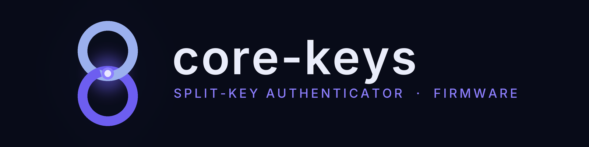

<p align="center">
  
</p>

# mule-esp32s3

Protocol-mule firmware for **core-keys**, a split-key hardware authenticator for
SSH and FIDO2: the desktop daemon and this device must both participate in every
authentication, and the device explicitly approves each use on its own button
and display.

ESP-IDF (v5.5.1) C firmware for a LilyGO T-Display-S3, enumerating as a
composite USB device: a CTAP HID interface (usage page 0xF1D0) plus a vendor HID
channel (0xFF00) that carries the Noise session.

> **Prototype, not the final signing core.** Nothing here is fit for real
> credentials yet — see the honest threat claims in
> [core-keys/spec](https://github.com/core-keys/spec).

## Build and flash

```sh
source ~/esp/esp-idf/export.sh
idf.py build
./reflash.sh                 # normal loop: vendor escape hatch -> ROM download -> flash
./flash.sh [port]            # first flash, while USB-Serial-JTAG still exists
./flash_from_download.sh     # when the escape hatch cannot run (physical BOOT hold)
./flash_when_back.sh         # after a physical unplug: waits for re-enumeration, then reflashes
./verify-enumeration.sh      # confirms the composite device and CTAP interface
```

Once the app runs, TinyUSB owns the native USB and the download port
disappears, which is why the escape hatch exists (magic `C0 DE B0 07` on the
vendor channel). After flashing, a physical power cycle is still the reliable
way to actually boot the new image; see the flashing notes in the spec repo's
`DESIGN.md`.

## Device UI preview (no hardware)

```sh
cc -I main tools/ui_preview.c main/ui_draw.c main/ui_screens.c main/fonts.c -lm -o /tmp/uip
/tmp/uip /tmp/ui_sheet.bmp
```

Renders every screen into one contact sheet. Per the tool's own comment this is
the regression gate before any flash: run it after touching `ui_draw.c`,
`ui_screens.c` or `fonts.c`.

## Generated assets (do not hand-edit)

- `python3 tools/gen_font.py ui` regenerates `main/fonts.{h,c}` (4 bpp
  anti-aliased faces from the vendored TTFs in `tools/fonts/`). Bare
  `python3 tools/gen_font.py` regenerates the legacy 1 bpp `main/font8x16.h`
  from a system TTF. Needs pillow.

## The core-keys repositories

| repo | what |
|---|---|
| [spec](https://github.com/core-keys/spec) | frozen design decisions and the section-numbered co-authorization wire protocol |
| [protocol](https://github.com/core-keys/protocol) | `corekeys-protocol`, the shared `no_std` wire crate |
| [daemon](https://github.com/core-keys/daemon) | `corekeys-daemon`, the desktop ssh-agent front end and Noise session owner |
| [mule-esp32s3](https://github.com/core-keys/mule-esp32s3) | ESP-IDF firmware for the protocol mule (LilyGO T-Display-S3) |
| [case-tdisplay-s3](https://github.com/core-keys/case-tdisplay-s3) | slide-in 3D-printed case for the board |

The wire this firmware speaks is implemented twice: in Rust in
[core-keys/protocol](https://github.com/core-keys/protocol), and in C here
(`main/ckvp.c`, `main/session.c`). Every wire change is a two-sided edit across
those two repositories.

## License

Everything in this repository that we wrote is dual-licensed under either the
[Apache License, Version 2.0](LICENSE-APACHE) or the [MIT license](LICENSE-MIT),
at your option. Unless you state otherwise, any contribution you intentionally
submit for inclusion in this work shall be dual-licensed as above, without
additional terms or conditions.

Third-party code and assets keep their own licenses and are not covered by the
above:

| path | upstream | license |
|---|---|---|
| `components/noisec/vendor/` | [rweather/noise-c](https://github.com/rweather/noise-c) | see `COPYING` there |
| `managed_components/` (fetched, not vendored) | Espressif, TinyUSB | see each component's `LICENSE` |
| `tools/fonts/InterVariable.ttf` | Inter | SIL Open Font License 1.1 |
| `tools/fonts/JetBrainsMono-Regular.ttf` | JetBrains Mono | SIL Open Font License 1.1 |

## Status

Design frozen; M1 (mule bring-up) in progress. Nothing here is fit for real
credentials yet.
